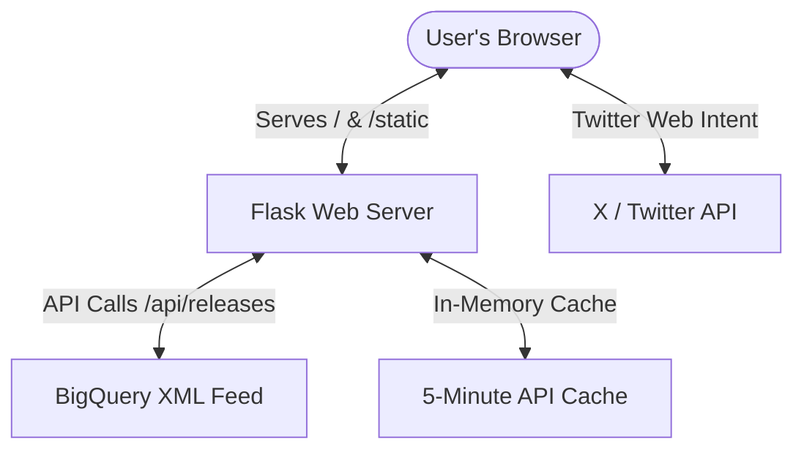
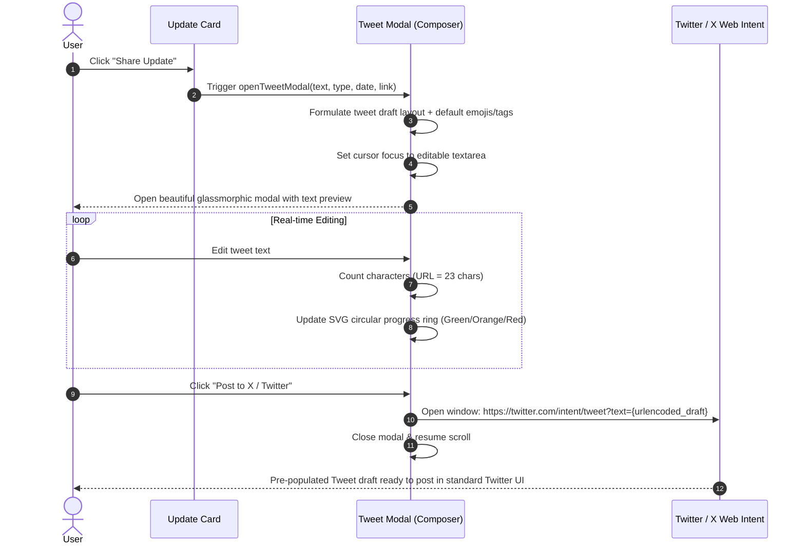

# BigQuery Release Hub & Sharer

Welcome to the **BigQuery Release Hub & Sharer**, a premium, high-performance web application that fetches Google Cloud's BigQuery Release Notes, presents them in a highly interactive timeline dashboard, and empowers you to selectively draft and share updates directly on X (Twitter).

The application is built with a lightweight, robust **Python Flask** backend and a stunning **Vanilla HTML/CSS/JavaScript** frontend with rich visual animations, glassmorphic dark-mode styling, and accurate real-time social drafting.

---

## 🏛️ Application Architecture



---

## 🚀 Key Features

* **Real-Time Feed Aggregation**: Dynamically pulls live RSS XML data from Google’s official BigQuery release notes servers.
* **Granular Update Categorization**: Deconstructs monolithic daily release updates into discrete, categorizable event items (e.g., separating a Feature, an Issue, and an Announcement that happened on the same day into individual elements).
* **Intelligent Caching and Reliability**: Implements in-memory server caching to safeguard against Google feed rate limits and maximize request speeds.
* **Search & Filters**: Instantly queries titles, bodies, and categories on the client side with negligible latency.
* **Twitter/X Intent Composer**: Automates the creation of visually rich drafts with dynamic hashtag inclusion, reference link appending, and a custom character counter tuned to real-time `t.co` URL shortening policies (which count any link as exactly 23 characters).

---

## 💾 Server-Side Deep Dive (`app.py`)

The server acts as a robust API bridge and data sanitization engine. 

### 1. In-Memory State Caching
To keep interactions instant, the server keeps an in-memory dictionary `feed_cache` which holds parsed release notes and a Unix timestamp. If subsequent requests fall within 5 minutes (`CACHE_DURATION = 300`), the server returns cached data instantly, entirely eliminating network delays.

### 2. Core XML Parsing (`parse_release_notes_xml`)
Google's feed uses the Atom standard with default namespaces. The parser utilizes Python's built-in `xml.etree.ElementTree` to target the `<entry>` nodes, extracting dates (`<title>`), links, and content blocks. Because element tags are prefixed with the Atom URI, mapping `{'atom': 'http://www.w3.org/2005/Atom'}` allows us to write clean xpath queries like `atom:entry` or `atom:title`.

### 3. HTML Document Segmenting (The BeautifulSoup Loop)
The CDATA section inside `<content type="html">` contains the HTML text of the updates. `app.py` passes this text into **BeautifulSoup4** to split it by `<h3>` tags. Each `<h3>` (e.g., `<h3>Feature</h3>`) starts a new update record. The server compiles both the raw HTML snippet (for clean frontend rendering) and plain text (for the Twitter compiler).

```python
soup = BeautifulSoup(content_html, 'html.parser')
sections = []
current_type = "General"
current_elements = []

for child in soup.contents:
    if child.name in ['h1', 'h2', 'h3', 'h4', 'h5', 'h6']:
        if current_elements:
            # We hit a new heading! Compile the previous category and save it.
            html_snippet = "".join(str(e) for e in current_elements).strip()
            text_snippet = " ".join(e.get_text() if hasattr(e, 'get_text') else str(e) for e in current_elements).strip()
            
            sections.append({
                'type': current_type,
                'html': html_snippet,
                'text': " ".join(text_snippet.split()) # clean up extra spaces
            })
            current_elements = []
        current_type = child.get_text().strip()
    elif child.name is not None or (isinstance(child, str) and child.strip()):
        current_elements.append(child)
```

---

## 🖥️ Client-Side Deep Dive

The client manages the presentation, data organization, and interactive workflows.

### 1. Style & Theme (`style.css`)
- **Ambient Space Dark Theme**: Tailored with a deep charcoal-and-slate canvas (`#0a0e1a`), illuminated by glowing high-blur fixed radial gradients that float in the background.
- **Visual Color Coding**: Category badges are styled with custom linear gradients:
  - **Feature**: Emerald & Cyan
  - **Issue**: Coral & Crimson
  - **Announcement**: Gold & Amber
  - **Deprecation**: Purple & Violet
- **Timeline Alignment**: A vertical line runs through the chronological date groups, and cards are rendered with staggered fade-in animations to feel premium and responsive.

### 2. Front-End Engine (`app.js`)
- **Networking**: Handles asynchronous `fetch` operations to the Flask API.
- **Dynamic State Engine**: Saves the parsed JSON payload globally and manages dual-filtering (active category filter and text keyword queries).
- **Interactive Composer**: Pre-populates the modal fields, allows users to toggle the inclusion of hashtags or source links, and calculates exact character counts on-the-fly, counting any web link as exactly 23 characters to match Twitter's strict `t.co` URL limits.

---

## 🔄 Step-by-Step Flow: Request and Response

### Sequence 1: Loading & Rendering the Notes

```mermaid
sequenceDiagram
    autonumber
    actor User
    participant Browser as Browser Client (app.js)
    participant Flask as Flask API (app.py)
    participant Cache as Cache Memory
    participant Google as Google Cloud Feed (XML)

    User->>Browser: Open http://127.0.0.1:5000
    Browser->>Flask: GET /
    Flask-->>Browser: Serve index.html, style.css, app.js
    Browser->>Browser: DOMContentLoaded triggers fetchReleases(force=false)
    Browser->>Flask: GET /api/releases?refresh=false
    
    rect rgb(30, 41, 59)
        note over Flask, Cache: Server Checks Memory Cache
        Flask->>Cache: Check if timestamp < 5 minutes old
        alt Cache is Invalid / Empty
            Flask->>Google: GET /feeds/bigquery-release-notes.xml
            Google-->>Flask: Returns Raw XML Feed (200 OK)
            Flask->>Flask: Parse XML, split HTML blocks with BeautifulSoup
            Flask->>Cache: Save parsed data & set current timestamp
        else Cache is Valid
            Flask->>Cache: Retrieve cached JSON array
        end
    end

    Flask-->>Browser: Return Structured JSON Release Notes Array
    Browser->>Browser: Apply search keyword & category filters
    Browser->>Browser: Render timeline elements & populate DOM
```



---

### Sequence 2: Drafting & Sharing a Tweet



---

## 📂 Project Directory Structure

```
agy-cli-projects/
├── .venv/                      # Python local virtual environment
├── app.py                      # Core Python Flask Application & API
├── templates/
│   └── index.html              # Responsive main layout & modal structures
└── static/
    ├── css/
    │   └── style.css           # Premium styling, variables, glassmorphism, animations
    └── js/
        └── app.js              # State engine, UI render, search/filter, Tweet Composer
```

---

## 🛠️ Launch & Development

The Flask application is already pre-configured and running in your workspace!

To view or access the application:
1. Open your browser and navigate to **[http://127.0.0.1:5000](http://127.0.0.1:5000)**.
2. Click **Refresh** to perform a live XML reload from Google Cloud.
3. Use the search bar, category chips, or click **Share Update** to try out the Twitter Composer.

### Manual Commands (if restarting or deploying in the future)

To install dependencies, activate the virtual environment, and launch Flask manually:
```powershell
# 1. Install dependencies from requirements.txt
pip install -r requirements.txt

# 2. Activate the virtual environment
.venv\Scripts\Activate.ps1

# 3. Run the Flask server
python app.py
```
